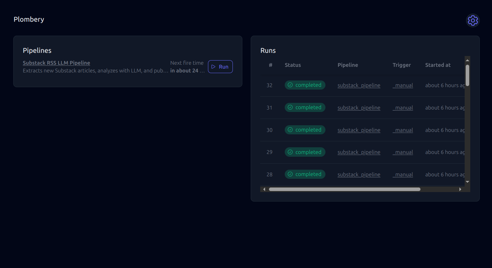
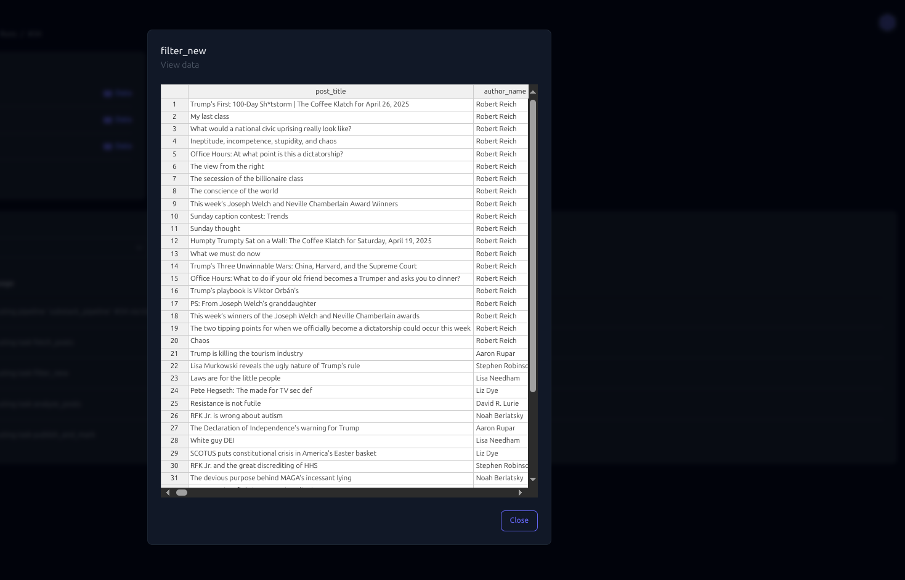
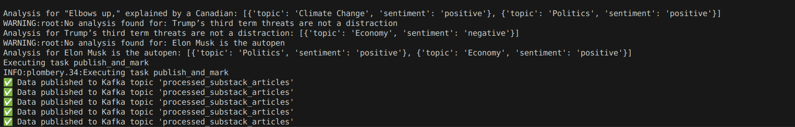
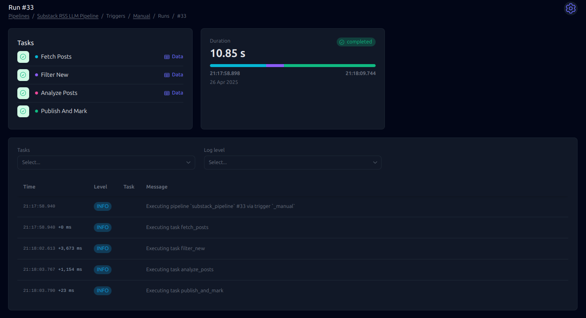
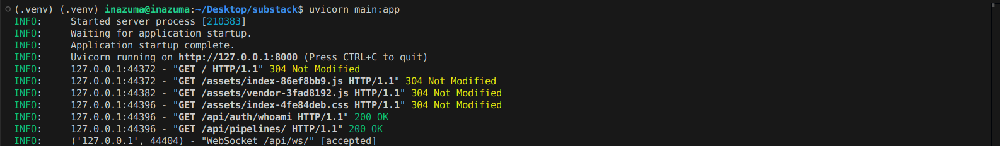
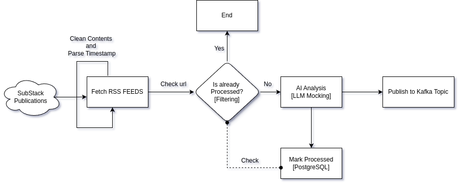

# substack_pipeline

## Overview (Screenshots)

<p align="center">
  
  
  
  
  
  
  
  
</p>

## Introduction

The purpose of this POC is to design and implement a multi-stage data pipeline, encompassing data extraction(and cleaning), enrichment via AI analysis, and publishing. This task
simulates a real-world scenario involving gathering information from substack publications
(like https://robertreich.substack.com/about and https://www.publicnotice.co/), processing
it, and making it available for downstream systems through Kafka topic.

## Objectives

1. Monitors a defined set of Substack publications(2).
2. Poll at certain interval to get the data(Every Midnight).
3. Extracts key information and content from these new posts.
4. Analyzes the extracted article content using an AI model (LLM) to identify key topics
and associated sentiment per topic(Mocked Sentiment Analysis).
5. Publishes the combined extracted and analyzed data to a streaming platform (Kafka
topic).

## Substack Publications Monitored

Chose on the basis of popularity and daily updates.
1. Robert Reich RSS Feed → https://robertreich.substack.com/feed
2. Public Notice RSS Feed → https://www.publicnotice.co/feed

## Tools

• Python : Program Source Code  
• Plombery : Orchestration Tool  
• Kafka : Publishing Message to Kafka Topic  
• Docker : Kafka Containerization  
• Feedparser, BeautifulSoup, html, re, emoji : Clean Text Parising  
• PostgreSQL : Persistent Storage(Marks and Checks Already Processed)  

## Pipeline Implementation

## Detailed Workflow

### 1. Detection Strategy
Every time RSS feeds are fetched:
- Parse each post’s URL.
- Compare the post URL against URLs stored in a PostgreSQL database.
- Only **new posts** (newer than the last stored) are sent for processing.

**Outcome:** Duplication is avoided and incremental updates are ensured.


### 2. Extraction Approach

**Source:**
- RSS feeds from two Substack sites:
  - [Robert Reich’s Substack](https://robertreich.substack.com/feed)
  - [Public Notice](https://www.publicnotice.co/feed)

**Libraries Used:**
- `feedparser` for parsing RSS XML.
- `BeautifulSoup` for HTML content extraction.
- `re`, `html`, `emoji` libraries for content cleaning.

**Parsing Logic:**
- Extract the following fields:
  - Post Title
  - Author Name
  - Publication Name
  - Timestamp
  - Post URL
  - Post Content (special cleaned extraction from `<content:encoded>`)

**Cleaning Content:**
- Remove HTML tags, unwanted promotional messages, images, buttons, emojis.
- Decode HTML entities.
- Strip non-ASCII characters.
- Normalize whitespace.

**Result:** Only pure, readable text remains for AI analysis.


### 3. AI Analysis Method

For each cleaned post content:
- Call an LLM (mocked).
- Send the content with a prompt like:

  > "Analyze the following article and return:  
  > 1. The list of main topics discussed (as keywords).  
  > 2. The overall sentiment (Positive, Negative, Neutral)."

**Expected Structured Response:**

```json
{
  "topics": ["economy", "inflation", "policy"],
  "sentiment": "Negative"
}
```
In this case, the AI analysis function can simply mock the output based on random
assignment.  
### 4. Kafka Message Schema
Each post after enrichment (content + AI analysis) is published as a JSON message
to Kafka, in a topic like processed substack articles.
```json
{
"post_title": "Post Title Here",
"author_name": "Author Name Here",
"publication_name": "Publication Name Here",
"timestamp": "2025-04-25T12:00:00+00:00",
"post_url": "https://example.substack.com/p/post-title",
"post_content": "Cleaned main text here...",
"topics": ["topic1", "topic2", "topic3"],
"sentiment": "Positive"
}
```
### 5. Update Database
Update database with latest processed timestamp and URL for tracking.

Pipeline finishes cleanly and waits for the next scheduled run.

## Setup Instructions 
### 1. Execution Steps
a. **Clone / Download** the project repository.  
b. **Install Dependencies** (see below).  
c. **Start Kafka** using Docker Compose:  
   - Run:  
     ```bash
     docker compose up -d
     ```
   - Create the Kafka topic (details below).
d. **Run the Python script:**
   - Start the application with:
     ```bash
     uvicorn main:app --reload
     ```

### 2. Dependencies Installation

- Install using `requirements.txt`:
  ```bash
  pip install -r requirements.txt```
OR  
- manually install all the above mentioned tools.

### 3. Kafka Setup
- **Docker Compose** file setup and run "docker compose up -d"
- **Create the topic**
  ```bash
  docker exec -it <kafka_container_id> /bin/bash kafka-topics.sh --create --topic processed_substack_articles --bootstrapserver localhost:9092 --partitions 1 --replication-factor ```

### 4. Database Configuration
Replace the following credentials with your own from utils/db.py file.  
```bash
dbname=’database_name’,
user=’username’,
password=’0000’,
host=’localhost’,
port=’5432’
```

## Assumptions Made
1. Both RSS entries contain either (content:encoded) or similar (content).
2. Polling everymidnight to get the batch of data.
3. A dummy notification system through plombery for catching and seeing notifications
easily of pipline. [config file in root directory]
4. AI model(mocked but if real) responds within a reasonable time in correct formatting
as requested.
5. PostgreSQL database (for tracking latest processed post timestamps) is available if
using full production mode.
